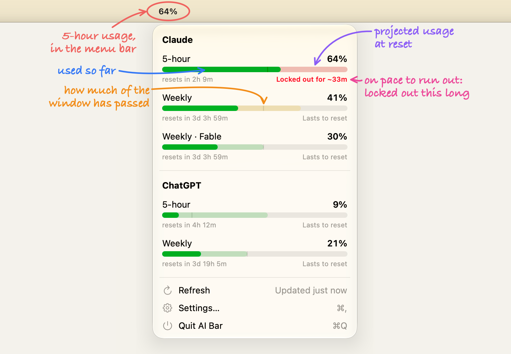

# AI Bar

A macOS menu bar app that shows how much of your AI provider rate limits you have used, and whether
you are on pace to run out before the window resets.

It shows Claude and ChatGPT. It reuses the sessions Claude Code and Codex already have, so there is
nothing to log in to. More providers plug in behind the `UsageProvider` protocol.



> **A personal project.** I built AI Bar for myself, and it is opinionated to match how I work: the
> providers I use, the windows I care about, the defaults I like. It is public in case it is useful to
> someone else.

## What you see

- **Menu bar reading** with the 5-hour window usage, for example `42%`, in the menu bar's own text colour
  like the clock beside it. With both providers on, their readings are stacked, Claude above ChatGPT, each
  behind its provider's logo, so the item stays as narrow as one reading. Whether you are on pace to run out
  shows in the tooltip and the popover.
- **Left click** opens a popover with every limit window of every provider: 5-hour, weekly, and weekly per
  model.
  Each bar is green below 70%, yellow from 70%, red from 90%. A translucent segment behind the bar
  shows the projected usage at reset, and a thin cursor marks how much of the window's time has
  passed: a fill past the cursor means usage is running ahead of time. A line underneath says how
  long you will be locked out (`Locked out for ~1h 20m`, or `~2d 19h` for a day or more, in red) or
  that the window `Lasts to reset`.
- **Right click**, or Refresh in the popover, refreshes immediately; a light runs round the pill
  and the icon turns while it runs, and the icon shows a checkmark once fresh data is in. The app also polls every 5 minutes and after the Mac wakes.
- Hover the pill for a tooltip with the reset countdown and, when you are on pace to run out, the lockout.

## How the forecast works

A rate-limit window opens at 0% on its first request, so usage is 0 at `resetsAt - windowLength`.
That anchor plus every reading taken during the window gives a least-squares line; extending it to
the reset time yields the projected usage. Readings are stored per window under
`~/Library/Application Support/AI Bar/` so the estimate survives restarts. The 5-hour window is
5 hours long, the weekly windows are 7 days.

## Settings

Settings… in the popover (or ⌘, while it is open) opens Settings: launch at login, how often to refresh
(1 to 15 minutes, default 5) and an optional shortcut that opens the popover from
any app (none by default). Each provider has one choice: which of its windows the pill shows, "Popover only", which keeps it
out of the menu bar, or "Off", which also stops fetching it. With no provider in the menu bar the item
shows a gauge icon, so the popover stays within reach. A Hyper key (all of ⌃⌥⇧⌘, e.g. Caps Lock remapped by Karabiner-Elements or Raycast)
shows as ✦. The shortcut needs ⌃ or ⌘ unless it is a function key, because macOS 15 ignores global shortcuts
built from ⌥ and ⇧ alone. Changes apply at once and are kept in the
app's user defaults (`defaults read com.torz.aibar`).

## How the data is fetched

Claude Code stores its OAuth token in the login Keychain under `Claude Code-credentials`. AI Bar
reads it with `/usr/bin/security` (the same approach other menu bar tools use, which avoids a
Keychain prompt per app) and calls `GET https://api.anthropic.com/api/oauth/usage`. The token is
never logged or written anywhere. If the token is missing or expired the pill shows `--%!` and the
popover says to sign in to Claude Code.

Codex keeps its ChatGPT session in `~/.codex/auth.json` (or under `CODEX_HOME`). AI Bar reads the access
token and account id from it and calls `GET https://chatgpt.com/backend-api/wham/usage`, the endpoint
behind Codex's own usage display. It only works when Codex is signed in with a ChatGPT plan, not an API
key, and when Codex keeps its credentials in that file rather than the Keychain. Renewing the token is
left to Codex, as it is to Claude Code.

## Requirements

- macOS 14 or newer
- Xcode 16 or newer (Swift 6 toolchain)
- Claude Code or Codex installed and signed in, for the providers you switch on

## Install or update

```
make install   # or scripts/install.sh
```

The same command does both jobs. It pulls the latest code (fast-forward only, so it stops instead of merging
into a checkout that has diverged), builds a release bundle, quits any running copy, puts the new one in
`/Applications` (`~/Applications` if that is not writable) and launches it. Settings and forecast history
are kept, because they live outside the bundle.

## Build and run

```
make build   # swift build
make test    # swift test
make app     # bundle dist/AI Bar.app
make run     # build and launch the app bundle
```

To run the live end-to-end tests against your own accounts:

```
AIBAR_LIVE_TESTS=1 swift test --filter UsageLive
```

## Project layout

```
Sources/AIBarCore   Foundation-only library: model, providers, forecasting, text, badge and bar
                    geometry. Everything here is unit-tested without AppKit.
Sources/AIBar       The menu bar app: status item, badge rendering, popover, polling controller.
Tests/AIBarCoreTests
Support/Info.plist  Bundle metadata (LSUIElement, so no Dock icon).
tickets/            The design notes each part was built from, in dependency order.
```

## Adding a provider

Implement `UsageProvider` in `AIBarCore` (an id, a display name, and `fetchUsage()` returning a
`UsageSnapshot` with one `UsageWindow` per limit), then add it to the provider list in
`AppDelegate`. Windows of kind `.fiveHour`, `.weekly` and `.weeklyModel` get forecasts automatically.
Settings lists the provider by itself. Give it a logo in `ProviderMark` to tell its reading apart in the
menu bar; the badge has room for two stacked readings, so a third provider needs a new layout.
